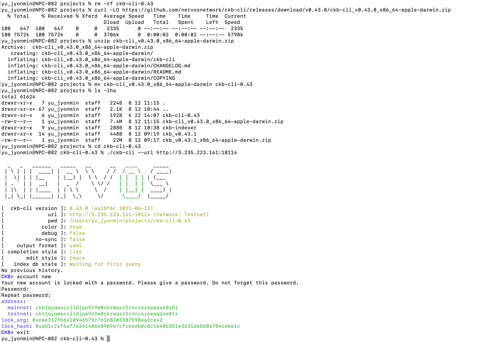
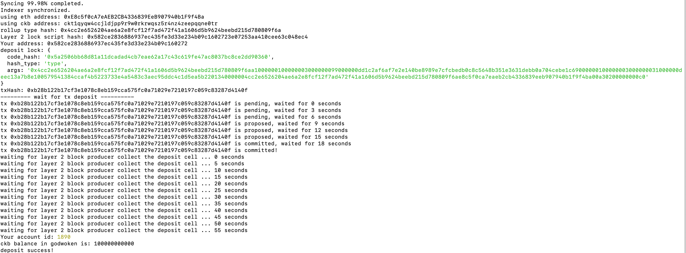

# Gitcoin: 1) Create A Godwoken Account On The EVM Layer 2 Testnet

1. A screenshot of the accounts you created (account list) in ckb-cli.

```sh
address:
  mainnet: ckb1qyqw4ccjldjpp9r9w0rkrwqsz5r4nz4zeepqak8s8l
  testnet: ckt1qyqw4ccjldjpp9r9w0rkrwqsz5r4nz4zeepqqne0tr
lock_arg: 0xeae312fb6410946573c761b8101507598aa2ce42
lock_hash: 0xdd1c2af6af7e2e140be8989e7cfcbedb0c8c5648b351e3631debb0a704cebe1c
```




2. A link to the Layer 1 address you funded on the Testnet Explorer.

link: https://explorer.nervos.org/aggron/address/ckt1qyqw4ccjldjpp9r9w0rkrwqsz5r4nz4zeepqqne0tr


3. A screenshot of the console output immediately after you have successfully submitted a deposit to Layer 2.

