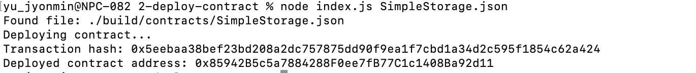

# Gitcoin: 2) Deploy A Simple Ethereum Smart Contract On Polyjuice

1. A screenshot of the console output immediately after you have successfully deployed a smart contract.


2. A link to the Layer 1 address you funded on the Testnet Explorer.
```sh
  Transaction hash: 0x5eebaa38bef23bd208a2dc757875dd90f9ea1f7cbd1a34d2c595f1854c62a424
```

3. A screenshot of the console output immediately after you have successfully submitted a deposit to Layer 2.
```sh
  Deployed contract address:: 0x85942B5c5a7884288F0ee7fB77C1c1408Ba92d11
```
