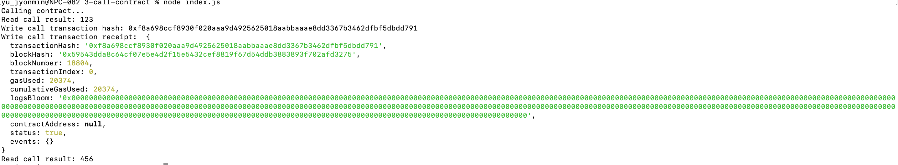

# Gitcoin: 3) Issue A Smart Contract Call To The Deployed Smart Contract

1. A screenshot of the console output immediately after you have successfully issued a smart contract call.


2. The transaction hash from the console output (in text format).
```sh
  Transaction hash: 0xf8a698ccf8930f020aaa9d4925625018aabbaaae8dd3367b3462dfbf5dbdd791
```

3. The contract address that you called (in text format).
```sh
  Called contract address: 0x85942B5c5a7884288F0ee7fB77C1c1408Ba92d11
```

4. The ABI for contract you made a call on (in text format).
```sh
  ABI: 
  "contractName": "SimpleStorage",
  "abi": [
    {
      "inputs": [],
      "stateMutability": "payable",
      "type": "constructor"
    },
    {
      "inputs": [
        {
          "internalType": "uint256",
          "name": "x",
          "type": "uint256"
        }
      ],
      "name": "set",
      "outputs": [],
      "stateMutability": "payable",
      "type": "function"
    },
    {
      "inputs": [],
      "name": "get",
      "outputs": [
        {
          "internalType": "uint256",
          "name": "",
          "type": "uint256"
        }
      ],
      "stateMutability": "view",
      "type": "function"
    }
  ],
```
