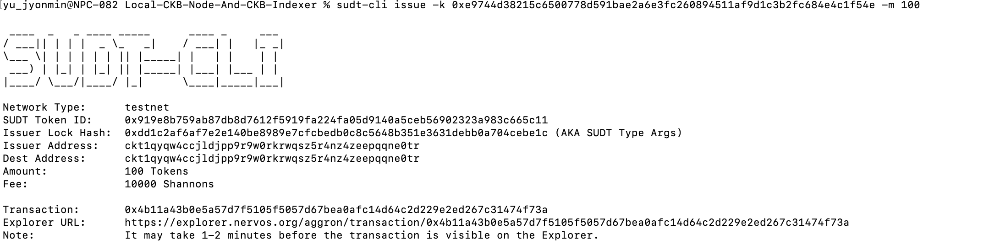
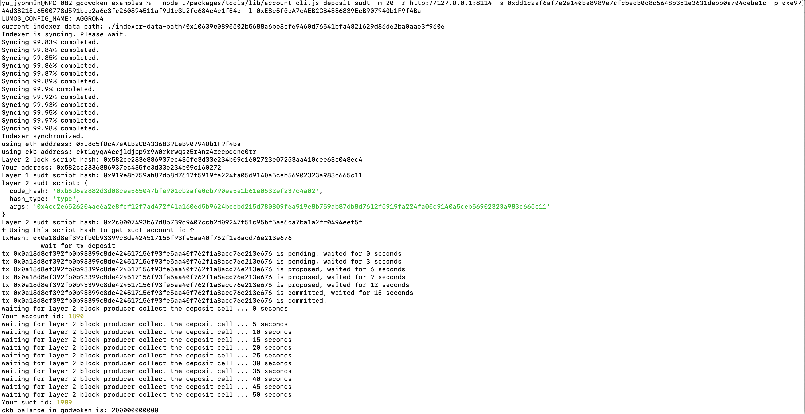

# Gitcoin: 4) Issue An SUDT Token On Layer 1 And Deposit It To Layer 2

1. A link to the Layer 1 address you funded on the Testnet Explorer.
link: https://explorer.nervos.org/aggron/address/ckt1qyqw4ccjldjpp9r9w0rkrwqsz5r4nz4zeepqqne0tr

2. A screenshot of the console output immediately after using sudt-cli to create your SUDT tokens on Layer 1.


3. A link to the transaction ID created by sudt-cli on the Testnet Explorer.
link: https://explorer.nervos.org/aggron/transaction/0x4b11a43b0e5a57d7f5105f5057d67bea0afc14d64c2d229e2ed267c31474f73a

4. A screenshot of the console output immediately after you have successfully submitted a deposit to Layer 2 using the account-cli tool.


5. The SUDT ID from the console output after executing the deposit script (in text format).
```sh
Your sudt id: 1989
```