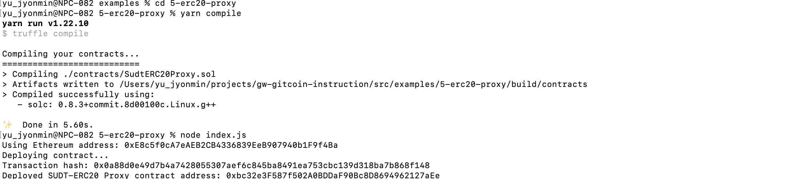
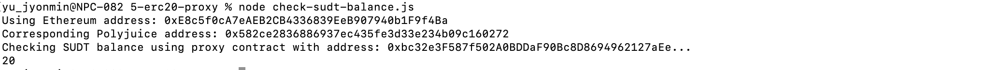

# Gitcoin: 5) Deploy The ERC20 Proxy Contract For The Deposited SUDT

1. A screenshot of the console output immediately after deploying smart contract.


2. The address of the ERC20 Proxy Contract you deployed (in text format).
```sh
Deployed SUDT-ERC20 Proxy contract address: 0xbc32e3F587f502A0BDDaF90Bc8D8694962127aEe
```

3. A screenshot of the console output immediately after checking your SUDT balance.


4. The Ethereum address that was checked (in text format).
```sh
Using Ethereum address: 0xE8c5f0cA7eAEB2CB4336839EeB907940b1F9f4Ba
```
