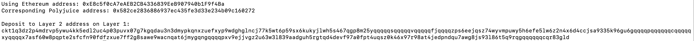

# Gitcoin: 6) Use Force Bridge To Deposit Tokens From Ethereum To Polyjuice

1. A screenshot of the console output immediately after you have successfully generated your Deposit Receiver Address.


2. Your Deposit Receiver Address (in text format).
```sh
Deposit to Layer 2 address on Layer 1: 
ckt1q3dz2p4mdrvp5ywu4kk5edl2uc4p03puvx07g7kgqdau3n3dmypkqnxzuefxyp9wdghglncj77k5wt6p59sx6kukyjlwh5s467qgp8m25yqqqqqsqqqqqvqqqqqfjqqqqzps6eejqsz74wyvmpuwy5h6efe5lw6z2n4x6d4ccjsa9335k96gu6gqqqqpqqqqqqcqqqqqxyqqqqx7asf60w8pqpte2sfcfn90fdfzxue7ff2g8sawe9wacnqat6jmygqngqqqqpxv9ejjvgz2u63w3l839aadguh5rgtqd4devf97a0fpt4uqsz0k46x97r98at4jedpndqu7awg8js93l86t5q9rqgqqqqqqcqr83gld
```

3. The Ethereum address used to generate the Deposit Receiver Address (in text format).
```sh
Using Ethereum address: 0xE8c5f0cA7eAEB2CB4336839EeB907940b1F9f4Ba
```

4. A link to the Etherscan explorer for the successful Force Bridge transaction. This can be found on Force Bridge under History→Succeed.
link: https://rinkeby.etherscan.io/tx/0x4aaeb46b3d74d21e3268eee40f1a755f893807002beb310970d9e627fc2889f2

5. A link to the Nervos explorer for the successful Force bridge transaction. This can be found on Force Bridge under History→Succeed.
link: https://explorer.nervos.org/aggron/transaction/0x7f43e1afd433e67bc29b34bfd414607e98af8b1e03ac831930a6a2cd035fdfb9
